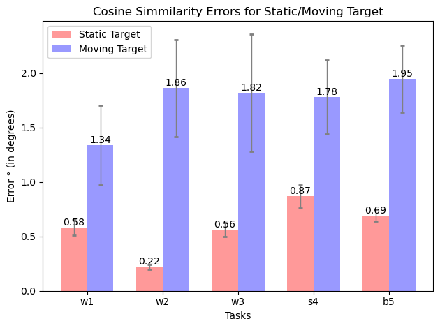
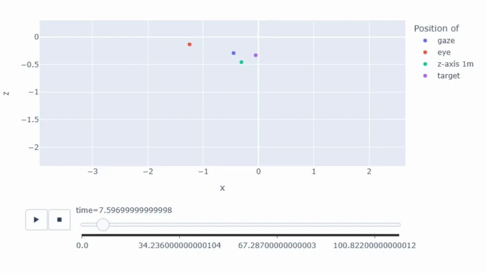
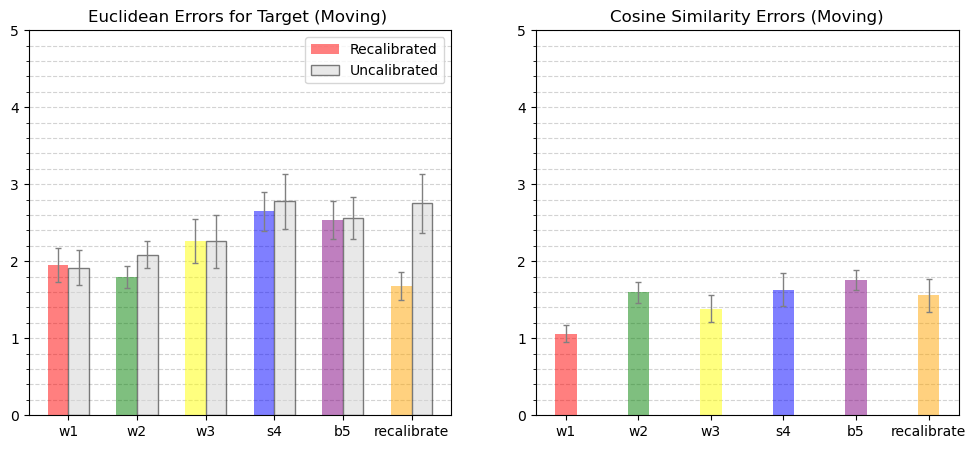
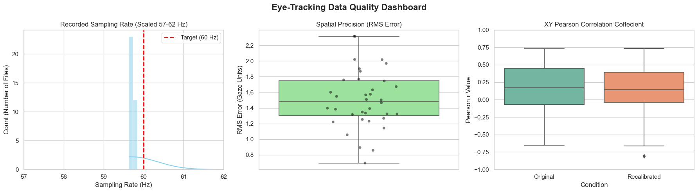
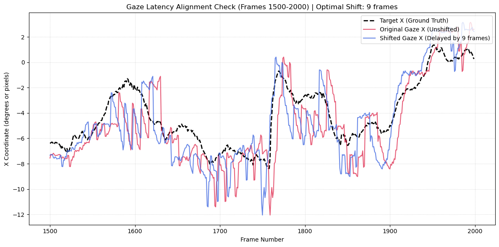

# Eye Tracking Test Suite (EyeTTS) - Data Module

This repository provides an optimized, end-to-end data processing, post-hoc recalibration, and statistical evaluation pipeline for mixed-reality eye-tracking datasets. It serves as the **analytical back-end foundation** for the **EyeTTS framework**.

### System Architecture: User Study Framework vs. Data Module
The EyeTTS framework is split into two halves: device-specific deployment environments that run on the hardware in real-time, and a centralized Python processing suite that analyzes the outputs post-hoc.

1. **Front-End User Study Framework (Data Collection):** These are the interactive, Unity-based mixed reality testing environments that human participants wear and interact with during empirical testing. The framework projects spatial targets, captures raw gaze vectors, and manages the user study tasks engineered to evaluate specific frame-of-reference conditions:
   *   **`w1` (World-Stabilized):** User head-constrained / world-stabilized target frame.
   *   **`w2` (World-Stabilized):** User body-constrained / world-stabilized target frame.
   *   **`w3` (World-Stabilized):** User actively walking / world-stabilized target frame.
   *   **`s4` (Screen-Stabilized):** User actively walking / screen-stabilized target frame.
   *   **`b5` (Body-Stabilized):** User actively walking / body-stabilized target frame.

   Because different headsets require distinct software setups and tracking SDKs, this deployment framework is split across three device-specific repositories:
   * **Magic Leap 1 Environment:** [satyam-aw/MagicLeap-EyeTracking](https://github.com/satyam-aw/MagicLeap-EyeTracking)
   * **Meta Quest Pro Environment:** [sydneylim/QuestPro_EyeTracking](https://github.com/sydneylim/QuestPro_EyeTracking)
   * **HoloLens 2 Environment:** [vivianross06/HoloLens-Eye-Tracking](https://github.com/vivianross06/HoloLens-Eye-Tracking)

2. **Back-End Data Module (This Repository):** This component acts as the receiver pipeline. It ingests the raw tracking logs generated during the execution of the tasks above to filter signals, eliminate spatial alignment drift, calculate metrics, and evaluate latency.

The peer-reviewed [poster](jupyter_notebooks/documentation/IEEEVR-2024-Poster-A0.pdf) presented on this work from **IEEE VR 24** can be referenced at the official [IEEE Xplore Library](https://doi.org/10.1109/VRW62533.2024.00321).

---

## Directory Structure

```text
├── jupyter_notebooks/                     
│   ├── comparing_static_moving.ipynb      # Dynamic stimulus versus static baseline error analysis
│   ├── error_plots.ipynb                  # Calibration efficiency evaluations & Type-II ANOVA models
│   ├── gaze_data_playback.ipynb           # Optimized time-series vectorization & dynamic spatial playback
│   ├── precision_correlation_x_y.ipynb    # Channel coupling evaluation & 60Hz hardware ISI auditing
│   ├── precision_saccade_smooth_fixation.ipynb # Behavior-specific RMS error extraction loop
│   ├── time_shift.ipynb                   # Signal latency alignment & transmission lag compensation
│   └── csv/                               # Local storage for experimental data tracks
|
├── participant-data/                  # Raw per-participant tracking logs
|
├── python_scripts/
│   ├── recalibrate_data.py            # Automated pipeline script for calibration & coordinate correction
│   └── util.py                        # Shared analytical subroutines (cleaning, linear regression, shifts)
|
├── recalibrated_data/                 # Outputs from baseline calibration runs ('cal' task)
│   ├── moving_target/
│   └── static_target/
└── recalibrated_data_others/          # Cross-task calibration validation outputs
    ├── b5/
    ├── s4/
    ├── w1/
    ├── w2/
    └── w3/
```

---

## Key Findings & Statistical Summary

Our cross-notebook analysis reveals distinct tracking performance variations driven by target dynamics, behavioral states, and system latency:

*   **Task Dynamics & Drift**: Eye-tracking precision drops on moving targets across all physical coordinate spaces (`w1–b5`). Post-hoc recalibration yields a **slight error reduction in 3 out of 5 moving tasks when the calibration target was static**, meaning spatial calibration does not produce a major or universal shift across all conditions.
*   **Behavior-Specific Precision**: Tracking error is highly context-dependent, scaling up significantly during rapid eye transitions:
    *   **Smooth Pursuit** (Continuous Tracking): Highest accuracy (**0.46°**). The eyes physically lock onto moving targets via visual feedback loops, stabilizing the gaze path and minimizing tracking deviation *(Heinen et al., 2016)*.
    *   **Baseline Fixation** (Continuous Tracking): Highly stable (**0.61°**).
    *   **Baseline Fixation** (Rapid Calibration): Degrades to **1.33°**.
    *   **Saccades** (Rapid Calibration): Worst tracking degradation (**1.98°**). These ballistic, jerky eye jumps outpace hardware sampling loops and suffer from physical micro-overshoots before settling on a target *(Purves et al., 2001)*.
*   **Performance Bottlenecks & Causes**: 
    *   *Signal Latency:* An inherent **9-frame** average lag (~150 ms) exists between the user's actual gaze and the moving target they follow, representing the combined human reaction time and the eye-tracking hardware-to-software pipeline delay.
    *   *Algorithmic Drag:* System smoothing filters successfully follow predictable *Smooth Pursuits* but create coordinate "drag" and spatial overshoots during abrupt *Saccades*. *Note: This software-level noise issue aligns with findings by Caruso et al. (2021) on the Magic Leap One, where developers had to explicitly adjust the gaze-tracking threshold within the CHARM simulator software to drop system noise and capture rapid saccadic jumps accurately.*
    * *Foveation Settling:* Rapid Calibration task "jumps" capture natural micro-saccadic tremors and human eye settling time upon landing on new, randomized target locations. Because the eye requires stabilization time after a ballistic saccade, these physiological corrections artificially inflate baseline fixation errors compared to the uniform, constant motion of the Continuous Tracking task.


---

## Notebook & Script Matrix

### Core Analysis Notebooks

#### 1. Static vs. Moving Stimulus Error Analysis (`comparing_static_moving.ipynb`)
Compares eye-tracking vector accuracy when interacting with stationary versus moving targets across multiple physical stabilization coordinate spaces (`w1`–`b5`). Uses 95% confidence intervals to evaluate precision variance.
<p align="center">
  
  <br>
  <em>Figure 1: Side-by-side grouped tracking errors showing precision degradation on dynamic stimuli across world vs. screen frames.</em>
</p>

#### 2. Dynamic Spatial Gaze Playback (`gaze_data_playback.ipynb`)
Integrates a highly optimized, vectorized string parser to transform structural text data into 2D coordinate spaces. Builds high-efficiency animation arrays tracking gaze, eye position, and targets over time.
<p align="center">
  
  <br>
  <em>Clip 1: Animated scatter rendering of real-time head-vector, eye, target, and computed gaze tracking positions.</em>
</p>

#### 3. Calibration Efficiency & Coordination Analysis (`error_plots.ipynb`)
Evaluates custom gaze calibration performance. Compares raw and calibrated Euclidean distances and utilizes a Type-II ANOVA alongside post-hoc Tukey HSD models ($\alpha = 0.05$) to establish significance across tracking states.
<p align="center">
  
  <br>
  <em>Figure 2: Distributive metrics evaluating raw tracking drift versus post-hoc calibrated residual alignment error.</em>
</p>

#### 4. Gaze Calibration & Sampling Frequency Validation (`precision_correlation_x_y.ipynb`)
Verifies dynamic recalibration parameters by calculating physical hardware sampling frequency consistency (Hz), inter-sample timeline gaps (ISI), and spatial trial gaze precision (RMS).
<p align="center">
  
  <br>
  <em>Figure 3: Inter-Sample Interval (ISI) histograms validating hardware stability and precision (RMS).</em>
</p>

#### 5. Behavioral Metric Extraction Pipeline (`precision_saccade_smooth_fixation.ipynb`)
Extracts specific performance precision bounds segmented by behavioral gaze actions including saccades, smooth pursuits, and static eye fixations.
| Gaze Behavior Type | Task Context | Mean Error ($\degree$) | 95% Confidence Interval [Lower, Upper] |
| :--- | :--- | :---: | :---: |
| **Smooth Pursuit** | Continuous Tracking Task | **0.4621** | `[0.4011, 0.5231]` |
| **Baseline Fixation** | Continuous Tracking Task | **0.6096** | `[0.5318, 0.6873]` |
| **Saccade** | Rapid Calibration Task | **1.9799** | `[1.6892, 2.2706]` |
| **Baseline Fixation** | Rapid Calibration Task | **1.3316** | `[1.2639, 1.3994]` |
| **Overall Pool** | Aggregate Combined Session | **1.0172** | `[0.8448, 1.1896]` |


#### 6. Eye-Tracking Signal Latency Analysis (`time_shift.ipynb`)
Handles dataset outlier management via winsorization and filters tracking drops. Applies cross-correlation lag algorithms to sync signals delayed by display pipeline latency up to 30 frames.
<p align="center">
  
  <br>
  <em>Figure 4: Cross-correlation coordinate time-series showing signal offset alignment before and after lag correction.</em>
</p>
<br>

### Automation Scripts
* **`python_scripts/recalibrate_data.py`**: A fully automated pipeline tool that fits individualized linear regression drift parameters per participant. It applies high-speed matrix calculations to correct gaze positions across tasks and writes outputs systematically to local datastores.

```bash
# Execute processing pipeline for moving targets calibrated with standard tasks
python python_scripts/recalibrate_data.py --type moving

# Execute pipeline using an alternate task calibration sequence
python python_scripts/recalibrate_data.py --type static --with w1
```
#### Available CLI Arguments Reference

| CLI Flag | Input Type | Required | Allowed Choices | Default Value | Description |
| :--- | :--- | :---: | :--- | :---: | :--- |
| `--type` | `string` | **Yes** | `moving`, `static` | *None* | Specifies the active target paradigm structure configuration. |
| `--with` | `string` | No | `cal`, `w1`, `w2`, `w3`, `s4`, `b5` | `cal` | Sets the explicit task file to recalibrate all the other tasks with using linear regression. |


---

## Refereed Poster Papers

This module forms the analytical foundation of, and directly links to, the engineering evaluations presented in the following peer-reviewed IEEE research contributions:

```bibtex
@inproceedings{vrw2024eyetracking,
  author    = {Awasthi, Satyam and Ross, Vivian and Lim, Sydney and Beyeler, Michael and Höllerer, Tobias},
  title     = {Eye Tracking Performance in Mobile Mixed Reality},
  booktitle = {2024 IEEE Conference on Virtual Reality and 3D User Interfaces Abstracts and Workshops (VRW)},
  year      = {2024},
  pages     = {321--322},
  doi       = {10.1109/vrw62533.2024.00321}
}

@inproceedings{ismar2023eyetts,
  author    = {Awasthi, Satyam and Ross, Vivian and Beyeler, Michael and Höllerer, Tobias},
  title     = {EyeTTS: Evaluating and Calibrating Eye Tracking for Mixed-Reality Locomotion},
  booktitle = {2023 IEEE International Symposium on Mixed and Augmented Reality Adjunct (ISMAR-Adjunct)},
  year      = {2023},
  pages     = {104--105},
  doi       = {10.1109/ismar-adjunct60411.2023.00104}
}
```


---
